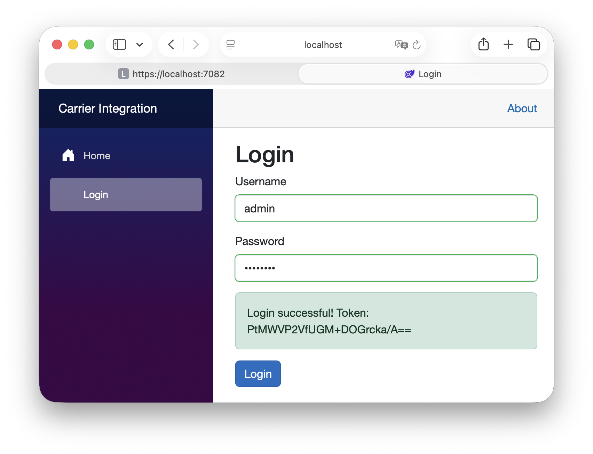
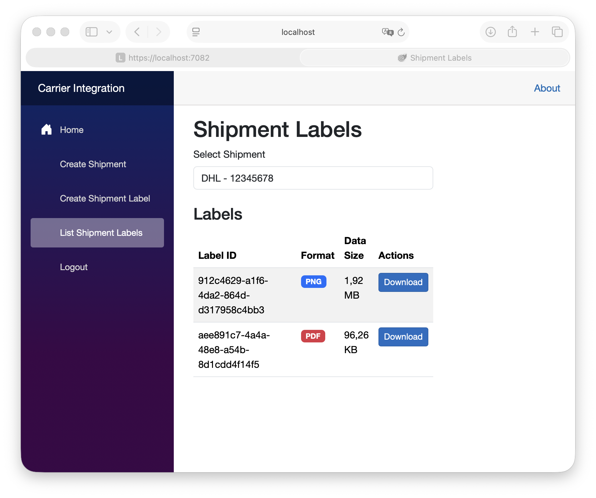

# CarrierIntegration

## Login Page Success

After solving the cross-site scripting issues, it is possible to get a token after a scuccesful login.

The assessment text was helpful to specify that a SpeedShipIntegrationService REST API needed to be created and a ICarierIntegration service, see CarierIntegrationCore. Via dependency injection, the interface is linked to the implementation CarierIntegrationModel. This should be done in a separate class library to prevent the dependency on CarrierIntegrationModel in SpeedShipIntegrationService.

Added pages to create a shipment and add multiple labels for a shipment. These are file uploads for now, not automatically created. The results can be viewed in the list shipment labels page where the labels can be downloaded.

## About Scalability

The site https://zineps.com mentions 99.9% uptime. However, that allows for almost 8 hours and 46 minutes of downtime. That means a high risk that users can encounted downtime.

We need fault tolerancy, by making sure all REST services can be restarted without impacting users.

Azure functions enable automatic scalabity. There is always a configuration parameter. We need to make sure that these are met.

The SpeedShipIntegrationService in this assessment has too much functionality. These could be split up into Azure functions for higher scalability.

The images in the website can be hosted in a CDN for faster load times.

Shipments that are fullfiled can be moved to a separate table. That way, processing the list of open shipments is retrieval is much faster and simpler.

## Build Instructions

dotnet build CarrierIntegrationCore/CarrierIntegrationCore.csproj
dotnet build CarrierIntegrationModel/CarrierIntegrationModel.csproj
dotnet build SpeedShipIntegrationService/SpeedShipIntegrationService.csproj
dotnet build CarrierIntegrationWebApp/CarrierIntegrationWebApp.csproj
dotnet run SpeedShipIntegrationService/SpeedShipIntegrationService.csproj
dotnet run CarrierIntegrationWebApp/CarrierIntegrationWebApp.csproj

Production deployment puts the REST API in a separate container and has a URL mapping so that the port number and CORS is not necessary. Both the web app and the REST API server will be in the same domain.

The data is now stored in memory. In a production setting that would be a (SQL Server) database.

## Accountability

Time spent: 2 hours on Friday evening after receiving the assessment, and 2 hours on Saterday morning.
AI used: GitHub GoPilot Pro (Claude Sonnet 4.5)
Visual Studio Code
Laptop: MacBook Pro M4 Max

* The Azure function part was not done.
* There are no unit tests (<b>update:</b> added).

Development method was to frequetly commit additional functionality to guide the AI. Each change was tested to make sure it worked to make sure the application remains stable.

If time allows for it, I will add the missing parts and mention the extra time spent.

## Extra Time

 Added unit tests. To facilitate that, the in-memory storage needed its static removed and put into a separate class called <code>ShippingDbContext</code> with a corresponding interface. This change was done manually. Afterwards, CoPilot was used to interpret the interface and generate unit tests. By dependency inject <code>IShippingDbContext</code> into <code>CarrierIntegration</code>, and using moq, the functionality is put under test, not the in-memory storage implementation.

 Time spent: 1 hour on Sunday morning